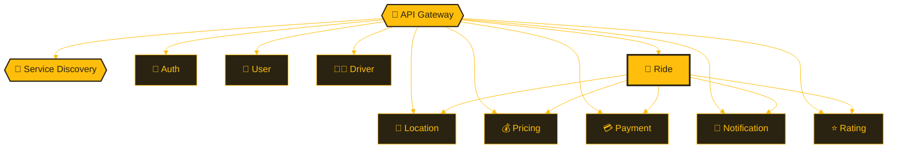

  

 

## 👨‍💻 About Me

I'm a **Java Backend Developer** focused on building backend applications and REST APIs with Java and Spring Boot. I learn by building projects that need real backend decisions, not just simple CRUD apps.

<table>
<tr>
<td width="50%" valign="top">

### 🔭 Current Focus

- ☕ Java 21 and object-oriented programming
- 🌱 Spring Boot and Spring Security
- 🔌 REST API development
- 🐘 PostgreSQL, JPA and Hibernate
- 🔐 Authentication and authorization

</td>
<td width="50%" valign="top">

### 🚀 Also Working On

- 🧩 Microservices architecture
- 🧪 API testing with Postman
- 🏗️ Backend system design
- 🧠 DSA and SQL practice
- 🎯 Interview-focused problem solving

</td>
</tr>
</table>

> 🚕 Currently developing **[Nexio](https://github.com/Thamizh70/nexio-microservices)**, a ride-hailing platform designed with a microservices architecture.

 

## 🛠️ Technical Skills

**Backend**

**Database**

**Tools**

**Learning / Integration Roadmap**

> [!NOTE]
> The amber badges are part of my current learning and integration roadmap. I don't present planned work as production experience.

 

## 🚕 Featured Project

Nexio is a backend project that models a real-world ride-hailing platform using independently organized services.

**Project focus**

| 🔐 Security | 🚖 Ride Domain | 🧩 Architecture |
|:--|:--|:--|
| JWT authentication and authorization | Ride booking and trip lifecycle | Microservice communication |
| OTP-based authentication flow | Location and driver tracking | Service discovery |
| User and driver management | Fare and pricing logic | Payment workflow |
| | Ratings and ride history | Notifications |

 

## 📚 Learning Path

```mermaid
%%{init: {'theme':'base','themeVariables':{'primaryColor':'#2A2312','primaryTextColor':'#FFBE0B','primaryBorderColor':'#FFBE0B','lineColor':'#FFBE0B'}}}%%
flowchart LR
    A["☕ Java"] --> B["🌱 Spring Boot"] --> C["🔐 Spring Security"] --> D["🐘 SQL & PostgreSQL"] --> E["🧩 Microservices"] --> F["🏗️ System Design"] --> G["🌐 Distributed Systems"]
    style A fill:#FFBE0B,color:#2A2312,stroke:#2A2312
    style B fill:#FFBE0B,color:#2A2312,stroke:#2A2312
    style C fill:#FFBE0B,color:#2A2312,stroke:#2A2312
```

 

## 🎯 Engineering Approach

<table>
<tr>
<td align="center" width="25%">🔌 <b>API Boundaries</b></td>
<td align="center" width="25%">🔐 <b>Auth & Security</b></td>
<td align="center" width="25%">🗄️ <b>Database Design</b></td>
<td align="center" width="25%">🧩 <b>Service Responsibilities</b></td>
</tr>
<tr>
<td align="center">🛡️ <b>Error Handling</b></td>
<td align="center">🔗 <b>Service Communication</b></td>
<td align="center">📈 <b>Scalability Basics</b></td>
<td align="center">🧹 <b>Maintainable Code</b></td>
</tr>
</table>

 

## 📈 GitHub Activity

  

  

 

## 🤝 Connect

&nbsp;

  

**Java • Spring Boot • Microservices • Backend Engineering**

